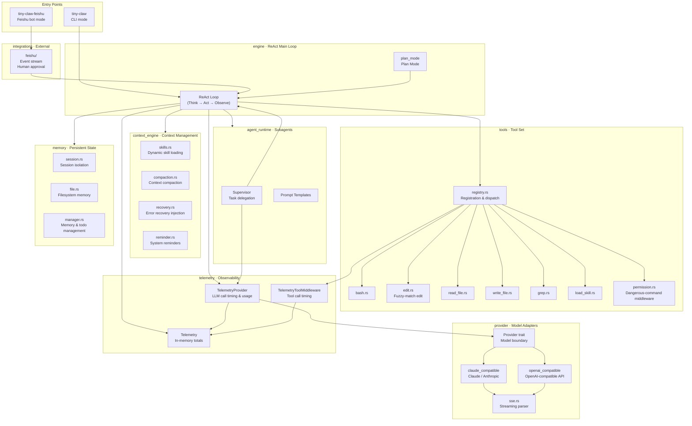

# Architecture Overview

High-level module map of the rust-tiny-claw Harness runtime.

## Layer Summary

| Layer | Module | Responsibility |
|---|---|---|
| Entry | `bin/` | CLI arg parsing; Feishu HTTP server bootstrap |
| Engine | `engine/`, `plan_mode` | ReAct loop orchestration; Plan Mode |
| Subagents | `agent_runtime/` | Subagent lifecycle, supervisor, prompt templates |
| Context | `context_engine/` | Skill loading, context compaction, error recovery, system reminders |
| Provider | `provider/` | Model-agnostic trait; Claude and OpenAI-compatible adapters; SSE parsing |
| Tools | `tools/` | Tool trait, registry, dispatch; permission and telemetry middleware |
| Memory | `memory/` | File-backed session state, working memory, todo management |
| Integration | `integrations/feishu/` | Feishu event stream; human-approval webhook |
| Telemetry | `telemetry/` | LLM token usage aggregation; LLM and tool elapsed-time totals |
